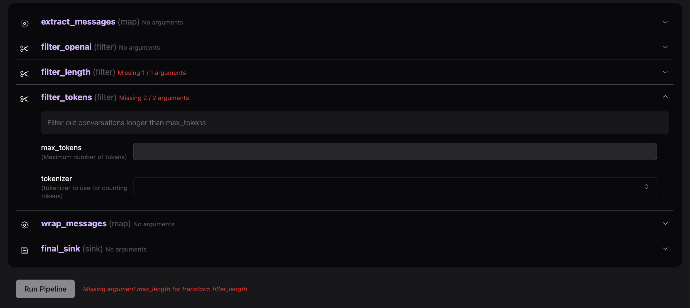

Overview
======================================

What is Taylor Pipelines?
--------------------------------------

Taylor Pipelines is a dynamic library for developing customizable data pipelines. You can transform
your unstructured data with modular AI components. Classify, filter, rebalance, embed, and more. 
When you build a script, Taylor Pipelines builds a frontend, turning your Python functions into parameterized data processing.

Parameterized Data Processing
--------------------------------------
The main purpose of Taylor Pipelines is to allow parameterized data processing with AI components for:

   - **ML Training**: Experimentation with new features and models is critical for ML training. Taylor Pipelines allows you to quickly build a frontend for your data processing, so you can focus on the ML.
   - **Structuring Unstructured Data**: Unstructured data, particularly text, doesn't have to be unusable. Run analytics on your unstructured data with Taylor Pipelines by classifying.
   - **Data Augmentation**: Data augmentation is a powerful tool for rebalancing your data. Taylor Pipelines allows you to quickly build a frontend for your data processing, so you can focus on the ML.

See the below example: 

.. code-block:: python

   import taylor_pipelines.argument as argument
   from taylor_pipelines.process import FunctionFilter

   # filter out conversations longer than max_tokens tokens
   def filter_tokens(messages, max_tokens, tokenizer):
      if len(tiktoken.encoding_for_model(tokenizer).encode(json.dumps(messages))) > max_tokens:
         return False
      return True

   filter_tokens_filter = FunctionFilter(
      "filter_tokens",
      filter_tokens,
      description="Filter out conversations longer than max_tokens",
      arguments=[
         argument.IntegerArgument("max_tokens", description="Maximum number of tokens"),
         argument.MultipleChoiceArgument("tokenizer", description="tokenizer for counting tokens", choices=["gpt2", "gpt-3.5-turbo"]),
      ],
   )

Taylor Pipelines executes the script and builds a frontend for you. You can then use the frontend to filter your data.

Why Taylor Pipelines?
--------------------------------------

Taylor Pipelines is for teams who need customizable data processing on top of their unstructured data systems (e.g. Amazon S3). If your data 
is unstructured, evolving, and you need to run analytics or build experimental models with it, Taylor Pipelines is for you. Rapidly iterate on 
your data without having to build a structured schema or a static pipeline.

Why not Taylor Pipelines?
--------------------------------------

Taylor Pipelines is intended for parameterized data processing. If you are looking for a library to build a static workflow or pipeline, you should consider `Apache Airflow <https://airflow.apache.org/>`_ or Luigi.